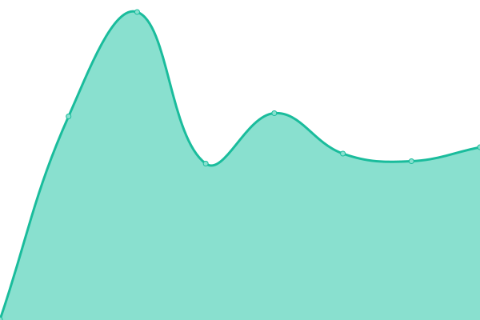

# [📈 Live Status](https://blankory.github.io/uptime): <!--live status--> **🟩 All systems operational**

This repository contains the open-source uptime monitor and status page for [Blanko ry](https://blanko.fi), powered by [Upptime](https://github.com/upptime/upptime).

With [Upptime](https://upptime.js.org), you can get your own unlimited and free uptime monitor and status page, powered entirely by a GitHub repository. We use [Issues](https://github.com/blankory/uptime/issues) as incident reports, [Actions](https://github.com/blankory/uptime/actions) as uptime monitors, and [Pages](https://blankory.github.io/uptime) for the status page.

<!--start: status pages-->
<!-- This summary is generated by Upptime (https://github.com/upptime/upptime) -->
<!-- Do not edit this manually, your changes will be overwritten -->
<!-- prettier-ignore -->
| URL | Status | History | Response Time | Uptime |
| --- | ------ | ------- | ------------- | ------ |
|  [Blanko www](https://blanko.fi) | 🟩 Up | [blanko-www.yml](https://github.com/blankory/uptime/commits/HEAD/history/blanko-www.yml) | 

 1598ms
     
 | 

<a href="https://up.blanko.fi/history/blanko-www">100.00%</a>
    

|  [Galleria](https://galleria.blanko.fi) | 🟩 Up | [galleria.yml](https://github.com/blankory/uptime/commits/HEAD/history/galleria.yml) | 

 771ms
     
 | 

<a href="https://up.blanko.fi/history/galleria">100.00%</a>
    

|  [Monitor](https://monitor.blanko.fi) | 🟩 Up | [monitor.yml](https://github.com/blankory/uptime/commits/HEAD/history/monitor.yml) | 

 536ms
     
 | 

<a href="https://up.blanko.fi/history/monitor">100.00%</a>
    

|  [Ovikello](https://ovikello.blanko.fi) | 🟩 Up | [ovikello.yml](https://github.com/blankory/uptime/commits/HEAD/history/ovikello.yml) | 

 536ms
     
 | 

<a href="https://up.blanko.fi/history/ovikello">100.00%</a>
    

|  [Portainer](https://portainer.blanko.fi) | 🟩 Up | [portainer.yml](https://github.com/blankory/uptime/commits/HEAD/history/portainer.yml) | 

 696ms
     
 | 

<a href="https://up.blanko.fi/history/portainer">100.00%</a>
    

|  [Sala](https://sala.blanko.fi) | 🟩 Up | [sala.yml](https://github.com/blankory/uptime/commits/HEAD/history/sala.yml) | 

 872ms
     
 | 

<a href="https://up.blanko.fi/history/sala">100.00%</a>
    

|  [Status](https://status.blanko.fi) | 🟩 Up | [status.yml](https://github.com/blankory/uptime/commits/HEAD/history/status.yml) | 

 530ms
     
 | 

<a href="https://up.blanko.fi/history/status">100.00%</a>
    

|  [Tenttiarkisto](https://tentit.blanko.fi) | 🟩 Up | [tenttiarkisto.yml](https://github.com/blankory/uptime/commits/HEAD/history/tenttiarkisto.yml) | 

 552ms
     
 | 

<a href="https://up.blanko.fi/history/tenttiarkisto">100.00%</a>
    

|  [Tivia oulu](https://tiviaoulu.fi/) | 🟩 Up | [tivia-oulu.yml](https://github.com/blankory/uptime/commits/HEAD/history/tivia-oulu.yml) | 

 1342ms
     
 | 

<a href="https://up.blanko.fi/history/tivia-oulu">100.00%</a>
    

|  [Torvi](https://torvi.blanko.fi) | 🟩 Up | [torvi.yml](https://github.com/blankory/uptime/commits/HEAD/history/torvi.yml) | 

 544ms
     
 | 

<a href="https://up.blanko.fi/history/torvi">100.00%</a>
    

<!--end: status pages-->

[**Visit our status website →**](https://blankory.github.io/uptime)

## 📄 License

- Powered by: [Upptime](https://github.com/upptime/upptime)
- Code: [MIT](./LICENSE) © [Blanko ry](https://blanko.fi)
- Data in the `./history` directory: [Open Database License](https://opendatacommons.org/licenses/odbl/1-0/)
